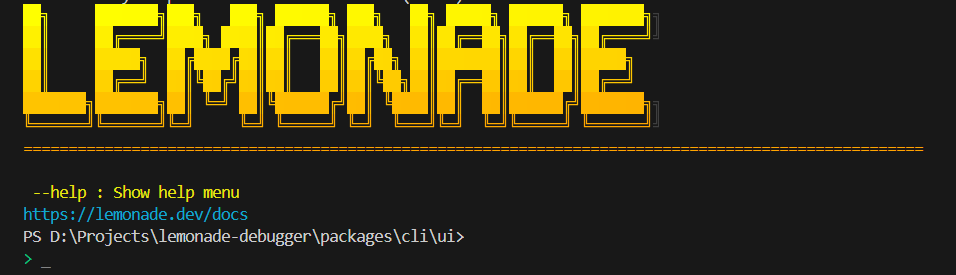
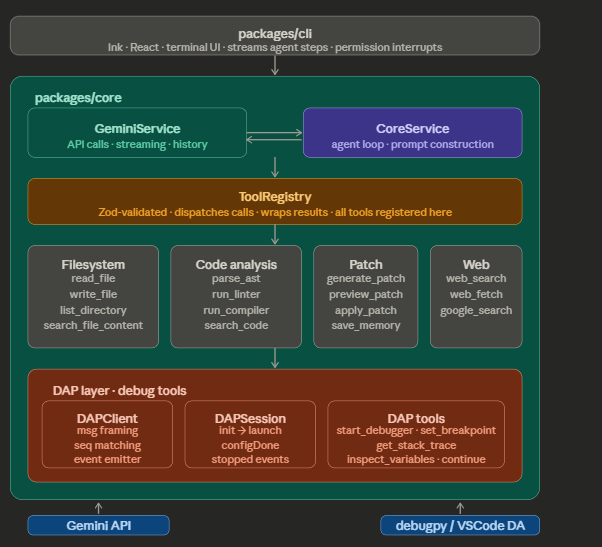

#  Lemonade AI Debugger - Architecture Plan

Full system overview across all 5 build phases.

---

## Build Phases

| Phase | Name | Focus |
|---|---|---|
| [Phase 1](#phase-1-dap-client) | DAP Client | Technical foundation |
| [Phase 2](#phase-2-tool-layer) | Tool Layer | Deterministic I/O |
| [Phase 3](#phase-3-langgraph--state) | LangGraph + State | Orchestration |
| [Phase 4](#phase-4-agents) | Agents | Model routing |
| [Phase 5](#phase-5-memory--cli) | Memory + CLI | Persistence & UX |

---

## Phase 1 — DAP Client

> **The technical foundation.** Built and validated in isolation before touching LangGraph. This is the highest-risk piece — get it working standalone first.

### Protocol Flow

```
connect() → initialize → launch/attach → setBreakpoints → configDone → [stopped event] → stackTrace → variables → continue
```

### Components

**`DAPClient.js` — Core**
- Content-Length message framing
- Seq-number request/response matching
- Async event emitter for `stopped`, `terminated`, `output` events
- TCP + stdio transports

**Adapters — Node.js + Python**
- Node: spawns `@vscode/debugadapter` over stdio
- Python: connects to `debugpy` over TCP (debugpy opens its own socket)
- Each adapter handles launch config

**`DAPSession.js` — Session API**
- Thin wrapper over DAPClient
- Exposes `initialize → launch → configurationDone` lifecycle
- Emits clean `stopped` event with frame + variables already resolved

**Agent Tools — 5 tool functions**

| Tool | Description |
|---|---|
| `start_debugger` | Launch/attach to a debug session |
| `set_breakpoint` | Set a breakpoint at a file/line |
| `get_stack_trace` | Retrieve the current call stack |
| `inspect_variables` | Read variable values at a frame |
| `continue_execution` | Resume program execution |

All tools are Zod-validated on input and output.

---

## Phase 2 — Tool Layer

> **All deterministic, no LLM inside.** Every tool is a pure function: validated input in, structured result out. Agents call these — they never talk to the filesystem or runtime directly.

| Category | Tool(s) | Notes |
|---|---|---|
| Filesystem | `read_file`, `write_file`, `list_files` | `write_file` is approval-gated |
| Discovery | `search_code` | ripgrep-based; regex or text across entire project |
| AST | `parse_ast` | tree-sitter; extracts function sigs, imports, call graphs |
| Static Analysis | `run_linter`, `run_compiler` | ESLint/Pylint, TSC/mypy; results cached within session |
| Patch | `generate_patch`, `preview_patch`, `apply_patch` | Diff-style only; `apply_patch` is the sole disk-write, gated by user approval |
| Web | `web_search`, `search_docs` | Optional — only Web Agent uses these |

> **Schema approach:** All tools share a Zod schema file. Input schema validates before the function runs. Output schema validates before returning to the agent. Mismatches surface as tool errors, not silent bad data.

---

## Phase 3 — LangGraph + State

> **The graph is the orchestrator.** Agents are nodes. Tool outputs write to shared state. The Reflect → Fix loop is the key non-linear path.

### Execution Flow

```
Planner → Context → Static Analysis → Debug Agent → Fix Agent → Reflect ↺ → interrupt() → Apply Patch
```

### Shared State Fields

All fields are Zod-typed and form a single source of truth:

`userQuery` · `loadedFiles` · `analysisResults` · `debugSession` · `proposedPatch` · `pendingPermission` · `reflectionScore` · `nextAgent`

### Checkpointer

| Environment | Backend |
|---|---|
| Dev | `MemorySaver` (in-memory) |
| Prod | SQLite / Postgres |

Enables `lemonade resume` after a terminal restart.

> **Conditional edges:**
> - Static Analysis → Fix Agent *(if lint/compile error is self-explanatory)*
> - Static Analysis → Debug Agent *(if runtime issue)*
> - Reflect → Fix Agent *(score < 0.7)*
> - Reflect → `interrupt()` *(score ≥ 0.7)*

---

## Phase 4 — Agents

> **Small models handle classification and retrieval. Large models handle reasoning.** Never overspend on a simple task.

| Agent | Role | Model |
|---|---|---|
| **Planner** | Interprets query, picks strategy (static-first vs runtime-first), routes to next agent | Small |
| **Context Agent** | Loads minimum viable context: target file + imports + involved functions | Small |
| **Static Analysis** | No LLM — runs linter + compiler, writes results to state, routes to Fix or Debug | None |
| **Debug Agent** | Attaches via DAP; sets breakpoints, collects stack trace + live variables, reasons about runtime state | Large |
| **Fix Agent** | Generates diff-style patch + explanation; never writes to disk — proposes only | Large |
| **Reflect** | Scores patch 0–1: does it address root cause? Regressions? Score < 0.7 → back to Fix with critique | Large |

---

## Phase 5 — Memory + CLI

> **Five distinct memory stores, each solving a different scope problem.** CLI connects via streaming.

### Memory Layers

| Layer | Store | Details |
|---|---|---|
| Short-term | Session state | Active conversation compressed into structured snapshot when too large; keeps token usage bounded |
| Long-term | `LEMONADE.md` | `~/.lemonade/` for global prefs; `project_root/` for project rules; read at session start, writable mid-session via `save_memory` |
| Runtime | Debug session memory | Breakpoints, stack traces, variable values at each frame; passed directly into Debug Agent context |
| Episodic | Past sessions | Summaries of prior debug sessions stored per-project for cross-session recall |

### CLI Integration

```
LangGraph (stream agent steps) → Ink (renders each step as it arrives) → permission interrupt → user input → resume/terminate edge
```

> **Permission system:** `LangGraph interrupt()` pauses mid-graph. Ink renders approval dialog. User response resumes or terminates the edge. Denied actions write to state so Planner can re-route.

---



*Built with [LangGraph](https://github.com/langchain-ai/langgraph) · [Debug Adapter Protocol](https://microsoft.github.io/debug-adapter-protocol/) · [Ink](https://github.com/vadimdemedes/ink)*